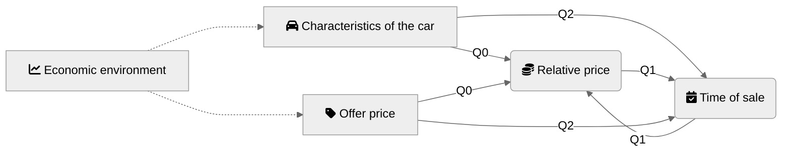

```{r setup, include=FALSE}
knitr::opts_chunk$set(echo = TRUE,
                      error = TRUE, fig.path = "figures/", dev = c("png", "pdf"), dpi = 400)
```

## Causality map



## Setup

```{r message=FALSE}
library(tidyverse)
```

## Data

```{r calendaer, fig.width=9}
load("data/cars_data.RData")

download_days <- prices_df %>% 
  pull(date) %>% 
  unique() %>% 
  sort()

Sys.setlocale("LC_TIME", "C") # mac os specific language setup
## [1] "C"
 calendR::calendR(
  start_date = "2021-05-01",
  end_date =  "2022-02-28",
  special.col = "lightblue",
  special.days = download_days - as.Date("2021-04-30"),
  start = "M"
)
```


