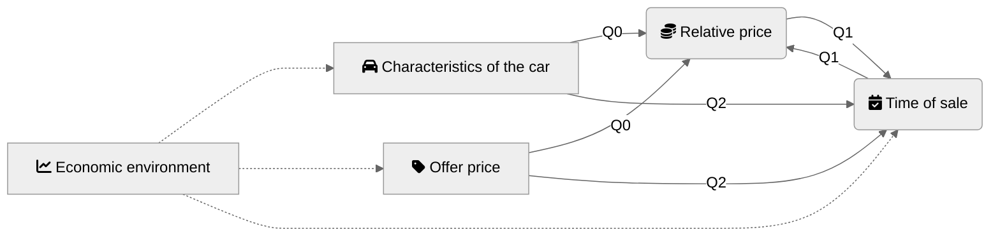
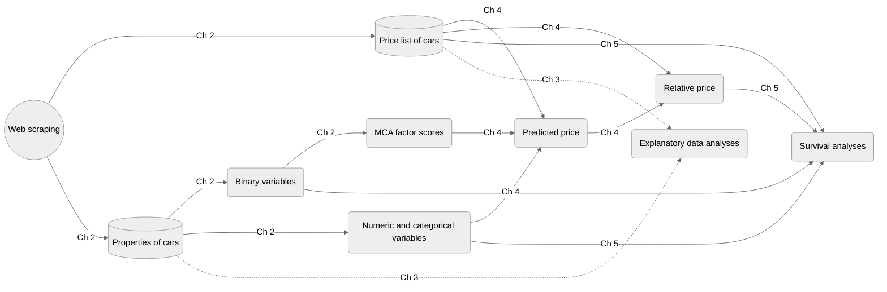

```{r setup, include=FALSE}
knitr::opts_chunk$set(echo = TRUE,
                      error = TRUE, fig.path = "figures/", dev = c("png", "pdf"), dpi = 400)
```

## Causality map





## Setup

```{r message=FALSE}
library(tidyverse)
library(survival)
library(survminer)
library(glmnet)
library(granatlib)
library(broom)
```

## Data

```{r calendar, fig.width=9}
load("data/cars_data.RData")

download_days <- prices_df %>% 
  pull(date) %>% 
  unique() %>% 
  sort()

Sys.setlocale("LC_TIME", "C") # mac os specific language setup
## [1] "C"
calendR::calendR(
  start_date = "2021-05-01",
  end_date =  "2022-02-28",
  special.col = "lightblue",
  special.days = download_days - as.Date("2021-04-30"),
  start = "M"
)
```

```{r cars_visdat}
load("data/cars_data.RData")
names_to_select <- cars_data %>% 
  names %>% 
  NiceName() %>% 
  enframe() %>% 
  arrange(- str_length(value)) %>% 
  pull()

cars_data %>% 
  sample_n(10000) %>% 
  rename_all(NiceName) %>% 
  select(names_to_select) %>% 
  select(- Id) %>% 
  rename_all(str_to_sentence) %>% 
  rename_all(str_replace, " mot", " MOT") %>% 
  visdat::vis_miss() +
  theme(
    plot.margin = margin(1,1.3,1,1, "cm")
  )
```

```{r impute}
c("nyari_gumi_meret ~ brand + evjarat + sajat_tomeg",
  "nyari_gumi_meret2 ~ brand + evjarat + sajat_tomeg",
  "nyari_gumi_meret3 ~ brand + evjarat + sajat_tomeg",
  "szallithato_szem_szama ~ brand + evjarat + sajat_tomeg",
  "ajtok_szama ~ brand + evjarat + sajat_tomeg + szallithato_szem_szama",
  "hengerurtartalom ~ brand + evjarat + szallithato_szem_szama",
  "henger_elrendezes ~ brand + evjarat + hengerurtartalom + teljesitmeny",
  "hajtas ~ brand + evjarat + teljesitmeny + uzemanyag",
  "sajat_tomeg ~ brand + evjarat + teljesitmeny + szallithato_szem_szama + ajtok_szama",
  "teljes_tomeg ~ brand + evjarat + teljesitmeny + szallithato_szem_szama + ajtok_szama",
  "uzemanyag ~ brand + evjarat + teljesitmeny + hengerurtartalom",
  "csomagtarto ~ brand + evjarat + szallithato_szem_szama + sajat_tomeg + teljes_tomeg") %>% 
  enframe(name = NULL) %>% 
  separate(value, c("imputed", "predictors"), "~") %>% 
  mutate(predictors = map(predictors, ~ str_split(., "[+]")[[1]])) %>% 
  unnest() %>% 
  mutate_all(str_trim) %>% 
  mutate_all(NiceName) %>% 
  group_by(imputed) %>% 
  summarise(predictors = str_c(predictors, collapse = ", ")) %>% 
  set_names("Imputed variable", "Predictors") %>% 
  mutate_all(str_to_sentence) %>% 
  granatlib::kable_output(align = c("c", "c"), caption = "Variables used for imputations.")
```

## EDA

### Price

```{r}
load("data/setup.RData")
```

```{r}
df %>% 
  mutate(
    qb = lubridate::floor_date(date, "quarter"),
    qe = lubridate::ceiling_date(date, "quarter"),
    qb = gsub("-01$", "", qb),
    qe = gsub("-01$", "", qe),
    qb = str_replace(qb, "-", "/"),
    qe = str_replace(qe, "-", "/"),
    Quarter = str_c(qb, "-", qe),
  ) %>% 
  group_by(Quarter) %>% 
  tot_summarise(total_name = "Total",
                Mean = mean(price),
                Median = median(price),
                `Standard deviation` = sd(price),
                Skeness = moments::skewness(price),
                Kurtosis = moments::kurtosis(price),
  ) %>% 
  arrange(as.character(Quarter)) %>% 
  mutate_at(2:4, format, big.mark = ",") %>% 
  kable_output(caption = "Descriptive statistics of offer prices.")
```

```{r}
df %>% 
  mutate(
    qb = lubridate::floor_date(date, "quarter"),
    qb = gsub("-01$", "", qb),
    qe = lubridate::ceiling_date(date, "quarter"),
    qe = gsub("-01$", "", qe),
    Quarter = str_c(qb, "/", qe),
  ) %>% 
  group_by(Quarter) %>% 
  mutate(
    q_mean = mean(price),
    q_mean = ifelse(!duplicated(Quarter), q_mean, NA)
  ) %>% 
  ggplot(aes(price)) + 
  geom_histogram() + 
  geom_vline(aes(xintercept = q_mean)) +
  facet_wrap(~ Quarter, ncol = 1)
```

```{r}
df %>% 
  left_join(select(cars_data, id, brand)) %>% 
  mutate(brand = str_to_title(brand)) %>% 
  group_by(brand) %>% 
  tot_summarise(total_name = "TOTAL",
                `Mean of offer prices` = mean(price),
                `Median of offer prices` = mean(price),
                n = n()
  ) %>% 
  ungroup() %>% 
  mutate(p = scales::percent(n / (sum(n) / 2), 1)) %>% 
  drop_na() %>% 
  arrange(desc(n)) %>% 
  head(11) %>%
  rename(`Number of sold car` = n, `Proportion of total` = p, `Brand` = brand) %>% 
  mutate_at(2:3, format, big.mark = ",") %>% 
  slice(c(2:n(), 1)) 

```

##

```{r brand}
options(scipen = 999)
df %>% 
  left_join(select(cars_data, id, brand)) %>% 
  select(brand, price) %>% 
  group_by(brand) %>% 
  mutate(n_brand = n()) %>% 
  ungroup() %>% 
  mutate(
    p_brand = n_brand / n(),
    brand = str_c(brand, " (", scales::percent(p_brand, .1), ")")
  ) %>% 
  mutate(
    brand = fct_lump(brand, n = 10),
    brand = fct_reorder(brand, price),
    brand = fct_relabel(brand, str_to_title)
  ) %>% 
  drop_na(brand) %>% 
  filter(brand != "Other") %>% 
  ggplot(aes(brand, price)) + 
  geom_boxplot() + 
  scale_y_log10(labels = ~ format(., big.mark = ",")) + 
  labs(
    x = "Brand",
    y = "Offer price (HUF, logscale)"
  ) + 
  theme(
    axis.text.x = element_text(angle = 60)
  )
```


```{r}
load("data/cars_data_imputed.RData")
```

```{r}
duration_df <- prices_df %>%
  arrange(date) %>% 
  group_by(id) %>% 
  slice(1, n()) %>% # first and last
  transmute(name = c("start", "end"), date) %>% 
  pivot_wider(values_from = date, names_prefix = "date_") %>% 
  ungroup() %>% 
  filter(date_start != min(date_start)) %>% 
  mutate(
    duration = date_end  - date_start,
    duration = as.numeric(duration),
  )
```

```{r km_quarterly, fig.height=4, fig.width=10}
km_df <- duration_df %>% 
  mutate(
    qb = lubridate::floor_date(date_start, "quarter"),
    qb = gsub("-01$", "", qb),
    qe = lubridate::ceiling_date(date_start, "quarter"),
    qe = gsub("-01$", "", qe),
    q = str_c(qb, " - ", qe),
    sold = date_end < "2022-03-01"
  )

km_df

km_all <- survfit(formula = Surv(duration, sold) ~ 1, data = km_df)

ggsurvplot(
  km_all, 
  risk.table = TRUE,
  conf.int = TRUE,      
  xlim = c(0,250),     
  legend = "none",
  xlab = "Time since the given car ad first appeared (days)",
  surv.scale = "percent",
  risk.table.title = "Number of unsold cars",
  break.time.by = 30, 
  ggtheme = theme_bw(), 
  risk.table.y.text.col = TRUE, 
  risk.table.y.text = FALSE, 
)
```

```{r}
broom::glance(km_all)
```


### Pairs

```{r}
df %>% 
  left_join(select(cars_data, id, brand)) %>% 
  mutate(
    brand = fct_lump(brand, n = 4),
    brand = fct_reorder(brand, price),
    brand = fct_relabel(brand, str_to_title)
  ) %>% 
  left_join(duration_df) %>% 
  select(price, kilometerora_allasa, duration, evjarat, brand) %>% 
  GGally::ggpairs(aes(color = brand))
```

## Fair price

```{r}
NiceNameModel <- function(x) {
  case_when(
    x == "boost_tree" ~ "EXtreme Gradient Boosting Training",
    x == "lm" ~ "Ordinary Least Squares",
    x == "mlp" ~ "Single-hidden-layer neural network",
    x == "nearest_neighbor" ~ "K-Nearest Neighbor",
    x == "rand_forest" ~ "Random Forest",
    x == "svm" ~ "Linear support vector machines",
    x == "tree" ~ "Regression tree",
    TRUE ~ x
  )
}
```

```{r}
options(scipen = 999)

base_tune %>% 
  unnest() %>% 
  select(model, .metrics) %>% 
  distinct(model, .keep_all = TRUE) %>% 
  mutate(
    `# of hyperparameters` = map_dbl(.metrics, ~ ncol(.) - 4),
    `# of parameter combinations` = map_dbl(.metrics, ~ nrow(.) / 2),
  ) %>% 
  left_join(runtime_df) %>% 
  mutate(runtime = ifelse(model %in% c("mlp", "nearest_neighbor", "svm"), 
                          runtime * `# of parameter combinations`,
                          runtime
  )) %>% 
  select(- .metrics) %>% 
  mutate(
    model = NiceNameModel(model),
    runtime = format(runtime, digits = 0, big.mark = ",")
  ) %>% 
  rename(Model = 1, `Runtime (seconds)` = runtime) %>% 
  kable_output(caption = "Number of hyperparameteres, tested parameter combination and the total runtime of hyperparameter tuning.")
```


```{r}
base_tune <- list.files("data", full.names = TRUE) %>% 
  keep(str_ends, "tune.RData") %>% 
  enframe(name = NULL, value = "file_name") %>% 
  mutate(
    model = str_remove_all(file_name, "data/|.RData"),
    tune = map2(model, file_name, ~ {load(.y); get(.x)}),
    model = str_remove_all(model, "_tune"),
  )

base_tune %>% 
  filter(model != "lm") %>% 
  {
    walk2(.$model, .$tune, function(model, tune) {
      print(autoplot(tune) + ggtitle(model))
      show_best(tune, "rsq", n = 10) %>% 
        select(-.metric, -.estimator, -n, -.config, - std_err) %>% 
        select(- mean, everything(), `Average R-squared` = mean) %>% 
        kable_output(caption = str_c("Top 10 hyperparameter combination for ", NiceNameModel(model)), align = rep("c", 10), round_digits = 4) %>% 
        print()
    })
  }
```


##

```{r}
testing_tune <- base_tune %>% 
  mutate(
    best = map(tune, show_best, metric = "rsq", n = 1),
    best = map(best, select, mean, std_err)
  ) %>% 
  select(model, best) %>% 
  unnest() %>% 
  transmute(
    model, testing_mean = mean, testing_stderr = std_err,
    testing_ca = mean - std_err / (10^.5), testing_cf = mean + std_err / (10^.5)
  ) %>% 
  pivot_longer(-1) %>% 
  separate(name, c("set", "indicator"), "_")

```

```{r}
load("data/base_predict_folds2.RData")
```


```{r}
validation_tune <- base_predict_folds2_df %>% 
  select(testing) %>% 
  unnest() %>% 
  pivot_longer(-(1:2)) %>% 
  group_by(id, name) %>% 
  summarise(SST = sum((price-mean(price))^2), SSE = sum((price - value)^2), rsq = 1 - SSE / SST) %>% 
  # TODO sample or population
  group_by(name) %>% 
  summarise(mean = mean(rsq), stderr = sd(rsq), ca = mean - stderr / (10^.5), cf = mean + stderr / (10^.5)) %>%
  rename_at(-1, ~ str_c("validation_", .)) %>% 
  rename(model = name) %>% 
  pivot_longer(-1) %>% 
  separate(name, c("set", "indicator"), "_")
```

```{r tune_result, fig.height=3}
bind_rows(testing_tune, validation_tune) %>% 
  pivot_wider(names_from = indicator) %>% 
  mutate(
    model = NiceNameModel(model),
    mean_validation = ifelse(set == "validation", mean, 0),
    model = fct_reorder(model, mean_validation),
    set = str_to_sentence(set)
  ) %>% 
  ggplot(aes(y = model, group = set, color = set)) + 
  geom_errorbar(aes(xmin = ca, xmax = cf), position = position_dodge(width = .5)) + 
  geom_point(aes(x = mean), position= position_dodge(width = .5)) + 
  scale_x_continuous(labels = ~scales::percent(., 1)) + 
  labs(x = "R-squared", y = "Model", color = "CV sets") + 
  theme_bw() + 
  theme(legend.position = "bottom")
```

### Distribution 

```{r}
load("data/surv_raw_df.RData")
```

```{r}
surv_raw_df %>% 
  mutate(
    qb = lubridate::floor_date(date_end, "quarter"),
    qe = lubridate::ceiling_date(date_end, "quarter"),
    qb = gsub("-01$", "", qb),
    qe = gsub("-01$", "", qe),
    qb = str_replace(qb, "-", "/"),
    qe = str_replace(qe, "-", "/"),
    Quarter = str_c(qb, "-", qe),
  ) %>% 
  drop_na(price_diff) %>% 
  group_by(Quarter) %>% 
  tot_summarise(total_name = "Total",
                `Min (%)` = min(price_diff),
                `Lower quartile (%)` = quantile(price_diff, .25),
                `Median (%)` = quantile(price_diff, .5),
                `Higher quartile (%)` = quantile(price_diff, .75),
                `Max (%)` = max(price_diff),
                `Standard deviation (%p)` = scales::percent(sd(price_diff), accuracy = .01)
  ) %>% 
  mutate_at(2:6, ~ scales::percent(. - 1, .01)) %>% 
  arrange(desc(Quarter)) %>% 
  kable_output(caption = "Descriptive statistics of value-for-money.", .keep_lines = c(1, 2, -1, -2))
```


## Surv Lasso

```{r}
load("data/surv_raw_df.RData")

n_used <- 1e4
set.seed(123)

surv_cv_df <- total_surv_df %>% 
  filter(duration > 0) %>% 
  sample_n(n_used)

x_cv <- surv_cv_df %>%
  select(- duration, - sold) %>% 
  recipe() %>% 
  step_dummy(all_nominal()) %>% 
  prep() %>% 
  juice() %>% 
  as.matrix()

y_cv <- surv_cv_df %>%
  select(time = duration, status = sold) %>% 
  as.matrix()

tictoc::tic(str_c("surv_lasso", n_used))
cvfit <- cv.glmnet(x_cv, y_cv, family = "cox", type.measure = "C")
granatlib::stoc()

x <- total_surv_df %>% 
  filter(duration > 0) %>% 
  select(- duration, - sold)

y <- total_surv_df %>%
  filter(duration > 0) %>% 
  select(time = duration, status = sold) %>% 
  as.matrix()

fit_1se <- glmnet(x, y, family = "cox", lambda = cvfit$lambda.1se)
```

```{r cvfit, fig.height=3}
plot(cvfit)
```


```{r}
vip::vi(cvfit) %>% 
  head(30) %>% 
  mutate(Sign = ifelse(Sign == "POS", "+", "-")) %>% 
  kable_output(round_digits = 4, same_digits = TRUE)
```

```{r}
plot(fit_1se)
```

```{r}
coef_1se <- broom::tidy(fit_1se) %>% 
  mutate(exp_estimate = exp(estimate))
```

```{r}
most_freq <- function(x) {
  x %>% 
    na.omit() %>% 
    enframe() %>% 
    count(value, sort = TRUE) %>% 
    pull(1) %>% 
    first()
}
```


```{r}
fix_values_df <- x %>% 
  summarise(
    across(where(is.numeric), median, na.rm = TRUE), 
    across(where(~ !is.numeric(.)), most_freq)
  ) %>% 
  select(names(x))
```

```{r}
vars_vi <- vip::vi(cvfit) %>% 
  pull(Variable) %>% 
  head()
```

```{r}
predict_l <- vars_vi %>% 
  map(function(.var) {
    
    .full_var <- keep(names(x), ~ str_detect(.var, .)) %>% 
      enframe() %>% 
      mutate(l = str_length(value)) %>% 
      arrange(desc(l)) %>% 
      pull(value) %>% 
      first()
    
    possible_values <- pull(x, .full_var)
    if (is.numeric(possible_values)) {
      out <- seq(
        from = quantile(na.omit(possible_values), .05),
        to = quantile(na.omit(possible_values), .05),
        length.out = 200
      )
    }
    if (is.logical(possible_values)) {
      out <- c(TRUE, FALSE)
    }
    
    if (is.factor(possible_values) | is.character(possible_values)) {
      out <- c(TRUE, FALSE)
    }
    
    out_df <- out %>% 
      enframe(name = NULL) %>% 
      set_names(.full_var)
    # nrow(out_df)
    predict_df <- fix_values_df %>%
      select(- .full_var) %>%
      ungroup() %>% 
      slice(rep(1, nrow(out_df))) %>% 
      bind_cols(out_df) %>% 
      select(names(fix_values_df))
    
  })
```

```{r}
fit_cox <- coef_1se %>% 
  pull(term) %>% 
  select(.data = total_surv_df, duration, sold) %>% 
  coxph(formula = Surv(duration, sold) ~ .)
```

```{r}
cox.zph(fit_cox)
```


```{r}
predict_quantile_prob <- function(.fit, .data, .probs = c(.25, .5, .75), .keep_predictor = TRUE) {
  probablity_df <- predict(.fit, newdata = .data, response = "lp") %>% 
    tibble(lp = .) %>% 
    mutate(ci = exp(lp), id = row_number()) %>% 
    crossing(basehaz(.fit)) %>% 
    mutate(probability = exp(- hazard * ci))
  
  predicted_times_df <- map(.probs, function(x) {
    filter(probablity_df, probability <= x) %>% 
      distinct(id, .keep_all = TRUE) %>% 
      # > First time where the probability of surviving is less than the given prob
      select(id, time) %>%
      set_names("id", str_c("time_", x))
  })  %>%
    reduce(full_join, by = "id")  %>%
    right_join(
      probablity_df %>% 
        select(id) %>% 
        distinct()
    ) %>% 
    arrange(id)
  
  if (.keep_predictor) {
    
    predicted_times_df <- bind_cols(
      .data %>% 
        select_if(~ n_distinct(.) > 1),
      predicted_times_df %>% 
        select(- id)
    )
  } 
  predicted_times_df
}

coef_1se %>% 
  pull(term) %>% 
  select(.data = total_surv_df, duration, sold) %>% 
  sample_n(1000) %>% 
  predict_quantile_prob(.fit = fit_cox)
```

```{r}
partial_effect_data <- function(.data, .var, n = 100, integer = TRUE, cut_quantile = c(.1, .9)) {
  partial_values <- pull(total_surv_df, .var)
  if (is.numeric(partial_values)) {
    partial_quantials <- seq(from = quantile(partial_values, cut_quantile[1]), to = quantile(partial_values, cut_quantile[2]), length.out = n)
    if (integer) {
      partial_quantials <- unique(round(partial_quantials))
    }
  } else {
    partial_quantials <- unique(partial_values) %>% 
      na.omit()
  }
  
  partial_quantials_df <- enframe(partial_quantials, name = NULL) %>% 
    set_names(.var)
  
  most_freq <- function(x) {
    x %>%
      na.omit() %>%
      enframe() %>%
      count(value, sort = TRUE) %>%
      pull(1) %>%
      first()
  }
  
  .data %>%
    select(- .var) %>%
    summarise(
      across(where(is.numeric), median, na.rm = TRUE),
      across(where(~ !is.numeric(.)), most_freq)
    ) %>% 
    crossing(partial_quantials_df) %>% 
    select(names(.data))
}

partial_effect_data(total_surv_df, "pluss_karpit")
```

```{r}
cox_design_df <- fit_1se %>% 
  broom::tidy() %>% 
  pull(term) %>% 
  select(.data = total_surv_df, duration, sold)
```

### Effect of price to value

```{r}
cox_design_df %>% 
  partial_effect_data("price_diff", integer = FALSE, cut_quantile = c(0, 1), n = 100) %>% 
  predict_quantile_prob(.fit = fit_cox, seq(from = .1, to = .9, by = .1)) %>% 
  pivot_longer(- 1) %>% 
  mutate(
    name = str_remove(name, "time_"),
    name = as.numeric(name),
    l = ifelse(name == min(name), str_c("Probablity of selling=", scales::percent(1 - name, 1)), scales::percent(1 - name, 1)),
    l = fct_reorder(l, name)
  ) %>% 
  ggplot() +
  aes(price_diff, value, label = l, group = name, fill = l) +
  geom_area(position = position_dodge(), show.legend = FALSE) +
  geomtextpath::geom_textline(aes(color = name == .5, linewidth = name ==.5), show.legend = FALSE) +
  scale_fill_brewer(palette = 3) +
  scale_x_continuous(expand = c(0, 0), labels = scales::percent) +
  scale_y_continuous(expand = c(0, 0)) +
  labs(x = "Offer price / Predicted price", y = "Days to sell") +
  scale_color_manual(values = c("black", "red2"))
```

```{r}
cox_design_df %>% 
  partial_effect_data("price_diff", integer = FALSE, cut_quantile = c(0.1, .99), n = 100) %>% 
  predict_quantile_prob(.fit = fit_cox, seq(from = .1, to = .9, by = .1)) %>% 
  pivot_longer(- 1) %>% 
  mutate(
    name = str_remove(name, "time_"),
    name = as.numeric(name),
    l = ifelse(name == min(name), str_c("Probablity of selling=", scales::percent(1 - name, 1)), scales::percent(1 - name, 1)),
    l = fct_reorder(l, name)
  ) %>% 
  ggplot() +
  aes(price_diff, value, label = l, group = name, fill = l) +
  geom_area(position = position_dodge(), show.legend = FALSE) +
  geomtextpath::geom_textline(aes(color = name == .5, linewidth = name ==.5), show.legend = FALSE) +
  scale_fill_brewer(palette = 3) +
  scale_x_continuous(expand = c(0, 0), labels = scales::percent) +
  scale_y_continuous(expand = c(0, 0)) +
  labs(x = "Offer price / Predicted price", y = "Days to sell") +
  scale_color_manual(values = c("black", "red2"))
```

### Effect of year

```{r}
cox_design_df %>% 
  partial_effect_data("evjarat", integer = FALSE, cut_quantile = c(0.1, .99), n = 100) %>% 
  predict_quantile_prob(.fit = fit_cox, seq(from = .1, to = .9, by = .1)) %>% 
  pivot_longer(- 1) %>% 
  mutate(
    name = str_remove(name, "time_"),
    name = as.numeric(name),
    l = ifelse(name == min(name), str_c("Probablity of selling=", scales::percent(1 - name, 1)), scales::percent(1 - name, 1)),
    l = fct_reorder(l, name)
  ) %>% 
  ggplot() +
  aes(evjarat, value, label = l, group = name, fill = l) +
  geom_area(position = position_dodge(), show.legend = FALSE) +
  geomtextpath::geom_textline(aes(color = name == .5, linewidth = name ==.5), show.legend = FALSE) +
  scale_fill_brewer(palette = 3) +
  scale_x_continuous(expand = c(0, 0)) +
  scale_y_continuous(expand = c(0, 0)) +
  labs(x = "Offer price / Predicted price", y = "Days to sell") +
  scale_color_manual(values = c("black", "red2"))
```

### American

```{r}
survfit(formula = Surv(duration, sold) ~ amerikai_modell, data = total_surv_df) %>% 
  broom::tidy() %>% 
  group_by(strata) %>% 
  filter(estimate >= .5) %>% 
  slice_max(time, n = 1)
```

### Exhibit

```{r}
survfit(formula = Surv(duration, sold) ~ bemutato_jarmu, data = total_surv_df) %>% 
  broom::tidy() %>% 
  group_by(strata) %>% 
  filter(estimate >= .5) %>% 
  slice_max(time, n = 1)
```

### 

```{r}
survfit(formula = Surv(duration, sold) ~ henger_elrendezes, data = total_surv_df) %>% 
  broom::tidy() %>% 
  group_by(strata) %>% 
  filter(estimate >= .5) %>% 
  slice_max(time, n = 1)
```

```{r}
total_surv_df %>% 
  select(henger_elrendezes, where(is.numeric)) %>% 
  group_by(henger_elrendezes) %>% 
  summarise_all(mean)
```


```{r}
total_surv_df %>% 
  filter(henger_elrendezes == "Other") %>% 
  count(brand, sort = TRUE) %>% 
  mutate(p = n / sum(n))
```

```{r}
survfit(formula = Surv(duration, sold) ~ bukolampa, data = total_surv_df) %>% 
  broom::tidy() %>% 
  group_by(strata) %>% 
  filter(estimate >= .5) %>% 
  slice_max(time, n = 1)
```

```{r}
total_surv_df %>% 
  select(2:7, bukolampa, -brand)
```


## Robustness check

```{r}
set.seed(123)

surv_cv_df <- total_surv_df %>% 
  filter(price_diff <= quantile(price_diff, .95) & price_diff >= quantile(price_diff, .05)) %>% 
  filter(duration > 0) %>% 
  sample_n(n_used)

x_cv <- surv_cv_df %>%
  select(- duration, - sold) %>% 
  recipe() %>% 
  step_dummy(all_nominal()) %>% 
  prep() %>% 
  juice() %>% 
  as.matrix()

y_cv <- surv_cv_df %>%
  select(time = duration, status = sold) %>% 
  as.matrix()

tictoc::tic(str_c("surv_lasso", n_used))
cvfit <- cv.glmnet(x_cv, y_cv, family = "cox", type.measure = "C")
granatlib::stoc()

x <- total_surv_df %>% 
  filter(price_diff <= quantile(price_diff, .95) & price_diff >= quantile(price_diff, .05)) %>% 
  filter(duration > 0) %>% 
  select(- duration, - sold)

y <- total_surv_df %>%
  filter(price_diff <= quantile(price_diff, .95) & price_diff >= quantile(price_diff, .05)) %>% 
  filter(duration > 0) %>% 
  select(time = duration, status = sold) %>% 
  as.matrix()

fit_1se_r <- glmnet(x, y, family = "cox", lambda = cvfit$lambda.1se)
```

```{r fig.height=3}
plot(cvfit)
```


```{r}
cv_vip_r <- vip::vi(cvfit)
```

```{r}
cv_vip_r %>% 
  head(30) %>% 
  mutate(Sign = ifelse(Sign == "POS", "+", "-")) %>% 
  kable_output(round_digits = 4, same_digits = TRUE)
```

```{r}
coef_1se_r <- broom::tidy(fit_1se_r) %>% 
  mutate(exp_estimate = exp(estimate))
```


```{r}
fit_cox_r <- coef_1se_r %>% 
  pull(term) %>% 
  select(.data = total_surv_df, duration, sold) %>% 
  filter(price_diff <= quantile(price_diff, .95) & price_diff >= quantile(price_diff, .05)) %>% 
  coxph(formula = Surv(duration, sold) ~ .)
```

```{r coefs, fig.height=9}
full_join(tidy(fit_cox, conf.int = T), tidy(fit_cox_r, conf.int = T), by = "term") %>% 
  filter(!is.na(estimate.x) & !is.na(estimate.y)) %>% 
  pivot_longer(-term) %>% 
  mutate(
    model = ifelse(str_detect(name, ".x"), "All observations", "Inter-ventile"),
    name = str_remove(name, ".x|.y"),
    term = NiceName(term)
  ) %>% 
  pivot_wider() %>% 
  mutate(g = row_number() / n() > .5) %>% 
  ggplot(aes(y = term, color = model)) +
  # facet_wrap(~ g, scales = "free_y") +
  geom_vline(xintercept = 0) +
  geom_point(aes(x = estimate), position = position_dodge(width = .5), alpha = .8) +
  geom_errorbar(aes(xmin = conf.low, xmax = conf.high), position = position_dodge(width = .5), alpha = .8) +
  theme_bw() +
  theme(
    strip.text = element_blank(),
  ) +
  labs(
    color = NULL, x = "Estimated coefficient"
  )
```
