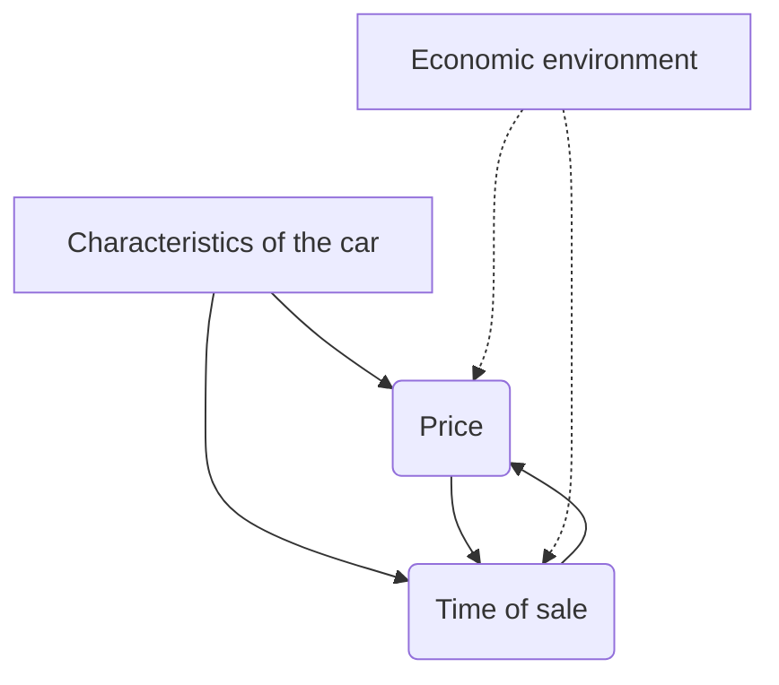

```{r setup, include=FALSE}
knitr::opts_chunk$set(echo = TRUE, error = TRUE, fig.path = "figures/", dev = c("png", "pdf"), dpi = 400)
```

## Causality map



## Setup

```{r}
library(tidyverse)
```

