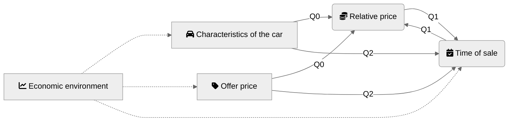
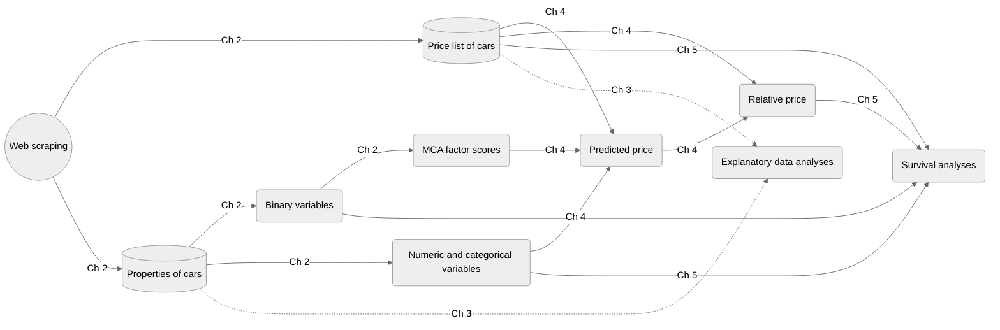

results - automobile-survival
================

## Causality map





## Setup

``` r
library(tidyverse)
library(survival)
library(survminer)
library(glmnet)
library(granatlib)
```

## Data

``` r
load("data/cars_data.RData")

download_days <- prices_df %>% 
  pull(date) %>% 
  unique() %>% 
  sort()

Sys.setlocale("LC_TIME", "C") # mac os specific language setup
```

    ## [1] "C"

``` r
## [1] "C"
calendR::calendR(
  start_date = "2021-05-01",
  end_date =  "2022-02-28",
  special.col = "lightblue",
  special.days = download_days - as.Date("2021-04-30"),
  start = "M"
)
```

<!-- -->

``` r
load("data/cars_data.RData")
names_to_select <- cars_data %>% 
  names %>% 
  NiceName() %>% 
  enframe() %>% 
  arrange(- str_length(value)) %>% 
  pull()

cars_data %>% 
  sample_n(10000) %>% 
  rename_all(NiceName) %>% 
  select(names_to_select) %>% 
  select(- id) %>% 
  rename_all(str_to_sentence) %>% 
  rename_all(str_replace, " mot", " MOT") %>% 
  visdat::vis_miss() +
  theme(
    plot.margin = margin(1,1.3,1,1, "cm")
  )
```

    ## Note: Using an external vector in selections is ambiguous.
    ## ℹ Use `all_of(names_to_select)` instead of `names_to_select` to silence this message.
    ## ℹ See <https://tidyselect.r-lib.org/reference/faq-external-vector.html>.
    ## This message is displayed once per session.

    ## Warning: `gather_()` was deprecated in tidyr 1.2.0.
    ## Please use `gather()` instead.
    ## This warning is displayed once every 8 hours.
    ## Call `lifecycle::last_lifecycle_warnings()` to see where this warning was generated.

<!-- -->

``` r
c("nyari_gumi_meret ~ brand + evjarat + sajat_tomeg",
  "nyari_gumi_meret2 ~ brand + evjarat + sajat_tomeg",
  "nyari_gumi_meret3 ~ brand + evjarat + sajat_tomeg",
  "szallithato_szem_szama ~ brand + evjarat + sajat_tomeg",
  "ajtok_szama ~ brand + evjarat + sajat_tomeg + szallithato_szem_szama",
  "hengerurtartalom ~ brand + evjarat + szallithato_szem_szama",
  "henger_elrendezes ~ brand + evjarat + hengerurtartalom + teljesitmeny",
  "hajtas ~ brand + evjarat + teljesitmeny + uzemanyag",
  "sajat_tomeg ~ brand + evjarat + teljesitmeny + szallithato_szem_szama + ajtok_szama",
  "teljes_tomeg ~ brand + evjarat + teljesitmeny + szallithato_szem_szama + ajtok_szama",
  "uzemanyag ~ brand + evjarat + teljesitmeny + hengerurtartalom",
  "csomagtarto ~ brand + evjarat + szallithato_szem_szama + sajat_tomeg + teljes_tomeg") %>% 
  enframe(name = NULL) %>% 
  separate(value, c("imputed", "predictors"), "~") %>% 
  mutate(predictors = map(predictors, ~ str_split(., "[+]")[[1]])) %>% 
  unnest() %>% 
  mutate_all(str_trim) %>% 
  mutate_all(NiceName) %>% 
  group_by(imputed) %>% 
  summarise(predictors = str_c(predictors, collapse = ", ")) %>% 
  set_names("Imputed variable", "Predictors") %>% 
  mutate_all(str_to_sentence) %>% 
  granatlib::kable_output(align = c("c", "c"), caption = "Variables used for imputations.")
```

    ## Warning: `cols` is now required when using unnest().
    ## Please use `cols = c(predictors)`

|       Imputed variable        |                                           Predictors                                           |
|:-----------------------------:|:----------------------------------------------------------------------------------------------:|
|       Cylinder capacity       |                   Brand, year of manufacture, number of persons transported                    |
|        Cylinder layout        |               Brand, year of manufacture, cylinder capacity, engine performance                |
|        Number of doors        |             Brand, year of manufacture, own weight, number of persons transported              |
| Number of persons transported |                             Brand, year of manufacture, own weight                             |
|          Own weight           | Brand, year of manufacture, engine performance, number of persons transported, number of doors |
|          Tire size 1          |                             Brand, year of manufacture, own weight                             |
|          Tire size 2          |                             Brand, year of manufacture, own weight                             |
|          Tire size 3          |                             Brand, year of manufacture, own weight                             |
|         Total weight          | Brand, year of manufacture, engine performance, number of persons transported, number of doors |
|             Trunk             |      Brand, year of manufacture, number of persons transported, own weight, total weight       |
|         Type of fuel          |               Brand, year of manufacture, engine performance, cylinder capacity                |
|          Wheel drive          |                  Brand, year of manufacture, engine performance, type of fuel                  |

Variables used for imputations.

## EDA

### Price

``` r
load("data/setup.RData")
```

``` r
df %>% 
  mutate(
    qb = lubridate::floor_date(date, "quarter"),
    qb = gsub("-01$", "", qb),
    qe = lubridate::ceiling_date(date, "quarter"),
    qe = gsub("-01$", "", qe),
    Quarter = str_c(qb, "/", qe),
  ) %>% 
  group_by(Quarter) %>% 
  tot_summarise(total_name = "Total",
                Mean = mean(price),
                Median = median(price),
                `Standard deviation` = sd(price),
                Skeness = moments::skewness(price),
                Kurtosis = moments::kurtosis(price),
  ) %>% 
  arrange(as.character(Quarter)) %>% 
  mutate_at(2:4, format, big.mark = ",") %>% 
  kable_output(caption = "Descriptive statistics of offer prices.")
```

| Quarter         |   Mean    |  Median   | Standard deviation | Skeness  | Kurtosis |
|:----------------|:---------:|:---------:|:------------------:|:--------:|:--------:|
| 2021-04/2021-07 | 3,710,100 | 1,949,000 |     4,821,653      | 2.795249 | 11.63271 |
| 2021-07/2021-10 | 3,774,025 | 1,950,000 |     4,883,133      | 2.731550 | 11.19031 |
| 2021-10/2022-01 | 3,904,783 | 1,990,000 |     5,057,759      | 2.626280 | 10.32879 |
| 2022-01/2022-04 | 4,068,776 | 2,200,000 |     4,873,486      | 2.524668 | 10.10797 |
| Total           | 3,871,298 | 1,999,000 |     4,931,980      | 2.659425 | 10.71338 |

Descriptive statistics of offer prices.

``` r
df %>% 
  mutate(
    qb = lubridate::floor_date(date, "quarter"),
    qb = gsub("-01$", "", qb),
    qe = lubridate::ceiling_date(date, "quarter"),
    qe = gsub("-01$", "", qe),
    Quarter = str_c(qb, "/", qe),
  ) %>% 
  group_by(Quarter) %>% 
  mutate(
    q_mean = mean(price),
    q_mean = ifelse(!duplicated(Quarter), q_mean, NA)
  ) %>% 
  ggplot(aes(price)) + 
  geom_histogram() + 
  geom_vline(aes(xintercept = q_mean)) +
  facet_wrap(~ Quarter, ncol = 1)
```

    ## `stat_bin()` using `bins = 30`. Pick better value with `binwidth`.

    ## Warning: Removed 566994 rows containing missing values (geom_vline).

<!-- -->

``` r
df %>% 
  left_join(select(cars_data, id, brand)) %>% 
  mutate(brand = str_to_title(brand)) %>% 
  group_by(brand) %>% 
  tot_summarise(total_name = "TOTAL",
                `Mean of offer prices` = mean(price),
                `Median of offer prices` = mean(price),
                n = n()
  ) %>% 
  ungroup() %>% 
  mutate(p = scales::percent(n / (sum(n) / 2), 1)) %>% 
  drop_na() %>% 
  arrange(desc(n)) %>% 
  head(11) %>%
  rename(`Number of sold car` = n, `Proportion of total` = p, `Brand` = brand) %>% 
  mutate_at(2:3, format, big.mark = ",") %>% 
  slice(c(2:n(), 1)) 
```

    ## Joining, by = "id"

    ## # A tibble: 11 × 5
    ##    Brand     `Mean of offer…` `Median of off…` `Number of sol…` `Proportion of…`
    ##    <fct>     <chr>            <chr>                       <int> <chr>           
    ##  1 Opel      1,932,382        1,932,382                   49187 9%              
    ##  2 Volkswag… 2,927,621        2,927,621                   49110 9%              
    ##  3 Ford      2,814,507        2,814,507                   43149 8%              
    ##  4 Bmw       6,291,093        6,291,093                   42115 7%              
    ##  5 Audi      6,882,042        6,882,042                   34006 6%              
    ##  6 Mercedes… 7,108,047        7,108,047                   33602 6%              
    ##  7 Toyota    3,162,746        3,162,746                   27268 5%              
    ##  8 Renault   1,848,393        1,848,393                   23122 4%              
    ##  9 Suzuki    2,124,386        2,124,386                   21982 4%              
    ## 10 Skoda     3,021,330        3,021,330                   20382 4%              
    ## 11 TOTAL     3,871,298        3,871,298                  566998 100%

## 

``` r
options(scipen = 999)
df %>% 
  left_join(select(cars_data, id, brand)) %>% 
  select(brand, price) %>% 
  group_by(brand) %>% 
  mutate(n_brand = n()) %>% 
  ungroup() %>% 
  mutate(
    p_brand = n_brand / n(),
    brand = str_c(brand, " (", scales::percent(p_brand, .1), ")")
    ) %>% 
  mutate(
    brand = fct_lump(brand, n = 10),
    brand = fct_reorder(brand, price),
    brand = fct_relabel(brand, str_to_title)
  ) %>% 
  drop_na(brand) %>% 
  filter(brand != "Other") %>% 
  ggplot(aes(brand, price)) + 
  geom_boxplot() + 
  scale_y_log10(labels = ~ format(., big.mark = ",")) + 
  labs(
    x = "Brand",
    y = "Offer price (HUF, logscale)"
  ) + 
  theme(
    axis.text.x = element_text(angle = 60)
  )
```

    ## Joining, by = "id"

<!-- -->

``` r
load("data/cars_data_imputed.RData")
```

``` r
duration_df <- prices_df %>%
  arrange(date) %>% 
  group_by(id) %>% 
  slice(1, n()) %>% # first and last
  transmute(name = c("start", "end"), date) %>% 
  pivot_wider(values_from = date, names_prefix = "date_") %>% 
  ungroup() %>% 
  filter(date_start != min(date_start)) %>% 
  mutate(
    duration = date_end  - date_start,
    duration = as.numeric(duration),
  )
```

``` r
km_df <- duration_df %>% 
  mutate(
    qb = lubridate::floor_date(date_start, "quarter"),
    qb = gsub("-01$", "", qb),
    qe = lubridate::ceiling_date(date_start, "quarter"),
    qe = gsub("-01$", "", qe),
    q = str_c(qb, " - ", qe),
    sold = date_end < "2022-03-01"
  )

km_df
```

    ## # A tibble: 530,850 × 8
    ##    id       date_start date_end   duration qb      qe      q               sold 
    ##    <chr>    <date>     <date>        <dbl> <chr>   <chr>   <chr>           <lgl>
    ##  1 10126621 2021-07-06 2021-07-13        7 2021-07 2021-10 2021-07 - 2021… TRUE 
    ##  2 12294919 2021-12-29 2022-01-11       13 2021-10 2022-01 2021-10 - 2022… TRUE 
    ##  3 12320330 2021-07-27 2021-10-25       90 2021-07 2021-10 2021-07 - 2021… TRUE 
    ##  4 12413210 2021-10-02 2022-01-11      101 2021-10 2022-01 2021-10 - 2022… TRUE 
    ##  5 12499044 2021-05-28 2022-02-24      272 2021-04 2021-07 2021-04 - 2021… TRUE 
    ##  6 12509167 2021-05-25 2021-09-01       99 2021-04 2021-07 2021-04 - 2021… TRUE 
    ##  7 12682244 2021-05-29 2021-11-02      157 2021-04 2021-07 2021-04 - 2021… TRUE 
    ##  8 12808858 2021-08-13 2021-11-05       84 2021-07 2021-10 2021-07 - 2021… TRUE 
    ##  9 12838591 2021-05-23 2022-01-17      239 2021-04 2021-07 2021-04 - 2021… TRUE 
    ## 10 12892086 2021-09-13 2022-01-21      130 2021-07 2021-10 2021-07 - 2021… TRUE 
    ## # … with 530,840 more rows

``` r
km_all <- survfit(formula = Surv(duration, sold) ~ 1, data = km_df)

ggsurvplot(
  km_all, 
  risk.table = TRUE,
  conf.int = TRUE,      
  xlim = c(0,250),     
  legend = "none",
  xlab = "Time since the given car ad first appeared (days)",
  surv.scale = "percent",
  risk.table.title = "Number of unsold cars",
  break.time.by = 30, 
  ggtheme = theme_bw(), 
  risk.table.y.text.col = TRUE, 
  risk.table.y.text = FALSE, 
)
```

<!-- -->

### Pairs

``` r
df %>% 
  left_join(select(cars_data, id, brand)) %>% 
  mutate(
    brand = fct_lump(brand, n = 4),
    brand = fct_reorder(brand, price),
    brand = fct_relabel(brand, str_to_title)
  ) %>% 
  left_join(duration_df) %>% 
  select(price, kilometerora_allasa, duration, evjarat, brand) %>% 
  GGally::ggpairs(aes(color = brand))
```

    ## Registered S3 method overwritten by 'GGally':
    ##   method from   
    ##   +.gg   ggplot2

    ## Joining, by = "id"
    ## Joining, by = "id"

    ## Warning in ggally_statistic(data = data, mapping = mapping, na.rm = na.rm, :
    ## Removed 28385 rows containing missing values

    ## Warning in ggally_statistic(data = data, mapping = mapping, na.rm = na.rm, :
    ## Removed 106702 rows containing missing values

    ## Warning in ggally_statistic(data = data, mapping = mapping, na.rm = na.rm, :
    ## Removed 28385 rows containing missing values

    ## Warning in ggally_statistic(data = data, mapping = mapping, na.rm = na.rm, :
    ## Removed 106702 rows containing missing values

    ## Warning in ggally_statistic(data = data, mapping = mapping, na.rm = na.rm, :
    ## Removed 28385 rows containing missing values

    ## Warning: Removed 106702 rows containing missing values (geom_point).
    ## Removed 106702 rows containing missing values (geom_point).

    ## Warning: Removed 106702 rows containing non-finite values (stat_density).

    ## Warning in ggally_statistic(data = data, mapping = mapping, na.rm = na.rm, :
    ## Removed 106702 rows containing missing values

    ## Warning: Removed 106702 rows containing non-finite values (stat_boxplot).

    ## Warning: Removed 106702 rows containing missing values (geom_point).

    ## `stat_bin()` using `bins = 30`. Pick better value with `binwidth`.
    ## `stat_bin()` using `bins = 30`. Pick better value with `binwidth`.
    ## `stat_bin()` using `bins = 30`. Pick better value with `binwidth`.

    ## Warning: Removed 106702 rows containing non-finite values (stat_bin).

    ## `stat_bin()` using `bins = 30`. Pick better value with `binwidth`.

<!-- -->

## Fair price

``` r
NiceNameModel <- function(x) {
  case_when(
    x == "boost_tree" ~ "EXtreme Gradient Boosting Training",
    x == "lm" ~ "Ordinary Least Squares",
    x == "mlp" ~ "Single-hidden-layer neural network",
    x == "nearest_neighbor" ~ "K-Nearest Neighbor",
    x == "rand_forest" ~ "Random Forest",
    x == "svm" ~ "Linear support vector machines",
    x == "tree" ~ "Regression tree",
    TRUE ~ x
  )
}
```

``` r
options(scipen = 999)

base_tune %>% 
  unnest() %>% 
  select(model, .metrics) %>% 
  distinct(model, .keep_all = TRUE) %>% 
  mutate(
    `# of hyperparameters` = map_dbl(.metrics, ~ ncol(.) - 4),
    `# of parameter combinations` = map_dbl(.metrics, ~ nrow(.) / 2),
  ) %>% 
  left_join(runtime_df) %>% 
  mutate(runtime = ifelse(model %in% c("mlp", "nearest_neighbor", "svm"), 
                          runtime * `# of parameter combinations`,
                          runtime
  )) %>% 
  select(- .metrics) %>% 
  mutate(
    model = NiceNameModel(model),
    runtime = format(runtime, digits = 0, big.mark = ",")
    ) %>% 
  rename(Model = 1, `Runtime (seconds)` = runtime) %>% 
  kable_output(caption = "Number of hyperparameteres, tested parameter combination and the total runtime of hyperparameter tuning.")
```

    ## Error in unnest(.): object 'base_tune' not found

``` r
base_tune <- list.files("data", full.names = TRUE) %>% 
  keep(str_ends, "tune.RData") %>% 
  enframe(name = NULL, value = "file_name") %>% 
  mutate(
    model = str_remove_all(file_name, "data/|.RData"),
    tune = map2(model, file_name, ~ {load(.y); get(.x)}),
    model = str_remove_all(model, "_tune"),
  )

base_tune %>% 
  filter(model != "lm") %>% 
  {
    walk2(.$model, .$tune, function(model, tune) {
      print(autoplot(tune) + ggtitle(model))
      show_best(tune, "rsq", n = 10) %>% 
        select(-.metric, -.estimator, -n, -.config, - std_err) %>% 
        select(- mean, everything(), `Average R-squared` = mean) %>% 
        kable_output(caption = str_c("Top 10 hyperparameter combination for ", NiceNameModel(model)), align = rep("c", 10), round_digits = 4) %>% 
        print()
    })
  }
```

<!-- -->

    ## 
    ## 
    ## Table: Top 10 hyperparameter combination for EXtreme Gradient Boosting Training
    ## 
    ## | trees | min_n | tree_depth | learn_rate | loss_reduction | sample_size | stop_iter | Average R-squared |
    ## |:-----:|:-----:|:----------:|:----------:|:--------------:|:-----------:|:---------:|:-----------------:|
    ## | 1746  |  16   |     6      |   0.0258   |       0        |   0.7102    |    14     |      0.9523       |
    ## | 1211  |   4   |     10     |   0.0074   |       0        |    0.315    |    20     |      0.9517       |
    ## | 1779  |  23   |     13     |   0.0528   |     0.0099     |   0.6565    |    13     |      0.9506       |
    ## | 1593  |   8   |     9      |   0.0082   |     0.0026     |   0.8579    |    12     |      0.9505       |
    ## |  869  |  12   |     14     |   0.006    |     0.0003     |   0.4159    |     5     |      0.9504       |
    ## | 1040  |  37   |     8      |   0.0113   |       0        |   0.4688    |    17     |       0.95        |
    ## | 1634  |  15   |     4      |   0.0823   |       0        |   0.4631    |     5     |      0.9485       |
    ## |  653  |  34   |     9      |   0.0185   |     0.0014     |   0.1692    |    14     |      0.9459       |
    ## |  595  |  17   |     3      |    0.05    |     0.0001     |   0.8412    |    16     |      0.9454       |
    ## | 1272  |   6   |     15     |   0.0098   |       0        |    0.951    |     9     |      0.9448       |

<!-- -->

    ## 
    ## 
    ## Table: Top 10 hyperparameter combination for Single-hidden-layer neural network
    ## 
    ## | hidden_units | penalty | epochs | Average R-squared |
    ## |:------------:|:-------:|:------:|:-----------------:|
    ## |      5       | 0.8302  |  644   |      0.9404       |
    ## |      5       | 0.5594  |  680   |      0.9403       |
    ## |      4       | 0.3096  |  851   |      0.9401       |
    ## |      5       | 0.1741  |  471   |       0.936       |
    ## |      4       | 0.0202  |  675   |      0.9359       |
    ## |      4       |  0.017  |  721   |      0.9353       |
    ## |      5       |  0.379  |  222   |      0.9329       |
    ## |      5       |    0    |  592   |      0.9321       |
    ## |      6       |  0.001  |  510   |      0.9312       |
    ## |      5       |    0    |  405   |      0.9309       |

<!-- -->

    ## 
    ## 
    ## Table: Top 10 hyperparameter combination for K-Nearest Neighbor
    ## 
    ## | neighbors | weight_func | dist_power | Average R-squared |
    ## |:---------:|:-----------:|:----------:|:-----------------:|
    ## |     2     |    rank     |   0.1465   |      0.8243       |
    ## |    13     |  gaussian   |   0.2589   |      0.8222       |
    ## |     9     |    rank     |   0.3331   |      0.8205       |
    ## |    11     |     cos     |   1.6533   |      0.8194       |
    ## |    13     |   optimal   |   1.4462   |       0.817       |
    ## |    11     |   optimal   |   1.8215   |      0.8164       |
    ## |     8     | triangular  |   1.865    |      0.8163       |
    ## |    12     |     cos     |   0.8301   |      0.8161       |
    ## |    14     | rectangular |   0.1868   |      0.8132       |
    ## |     9     |     inv     |   1.5549   |      0.8132       |

<!-- -->

    ## 
    ## 
    ## Table: Top 10 hyperparameter combination for Random Forest
    ## 
    ## | mtry | min_n | Average R-squared |
    ## |:----:|:-----:|:-----------------:|
    ## |  42  |   6   |      0.9404       |
    ## |  35  |   3   |      0.9404       |
    ## |  52  |   8   |       0.94        |
    ## |  75  |   3   |      0.9398       |
    ## |  47  |  16   |      0.9397       |
    ## |  65  |  14   |      0.9396       |
    ## |  28  |  11   |      0.9394       |
    ## |  72  |  12   |      0.9393       |
    ## |  58  |  19   |      0.9393       |
    ## |  41  |  22   |      0.9391       |

<!-- -->

    ## 
    ## 
    ## Table: Top 10 hyperparameter combination for Linear support vector machines
    ## 
    ## |  cost   | rbf_sigma | margin | Average R-squared |
    ## |:-------:|:---------:|:------:|:-----------------:|
    ## |  9.583  |  0.0025   | 0.1218 |      0.9347       |
    ## | 13.3887 |  0.0018   | 0.159  |      0.9345       |
    ## | 3.8105  |  0.0035   | 0.1333 |      0.9316       |
    ## | 1.8583  |  0.0006   | 0.1903 |      0.9152       |
    ## | 1.6808  |  0.0088   | 0.1661 |      0.9145       |
    ## | 3.2048  |  0.0004   | 0.0201 |      0.9129       |
    ## | 16.6023 |  0.0002   | 0.0103 |      0.9121       |
    ## | 6.1335  |  0.0094   | 0.1731 |      0.9114       |
    ## | 8.9552  |  0.0002   | 0.0002 |      0.9103       |
    ## | 5.4173  |  0.0001   | 0.1546 |      0.9063       |

<!-- -->

    ## 
    ## 
    ## Table: Top 10 hyperparameter combination for Regression tree
    ## 
    ## | cost_complexity | tree_depth | min_n | Average R-squared |
    ## |:---------------:|:----------:|:-----:|:-----------------:|
    ## |        0        |     10     |  39   |      0.8958       |
    ## |        0        |     8      |  25   |      0.8954       |
    ## |        0        |     9      |  34   |      0.8954       |
    ## |        0        |     9      |  28   |      0.8952       |
    ## |        0        |     8      |  36   |      0.8952       |
    ## |        0        |     10     |  25   |      0.8949       |
    ## |        0        |     10     |  21   |      0.8945       |
    ## |     0.0002      |     9      |  24   |      0.8938       |
    ## |        0        |     7      |  21   |      0.8925       |
    ## |        0        |     11     |  27   |       0.892       |

## 

``` r
testing_tune <- base_tune %>% 
  mutate(
    best = map(tune, show_best, metric = "rsq", n = 1),
    best = map(best, select, mean, std_err)
  ) %>% 
  select(model, best) %>% 
  unnest() %>% 
  transmute(
    model, testing_mean = mean, testing_stderr = std_err,
    testing_ca = mean - std_err / (10^.5), testing_cf = mean + std_err / (10^.5)
            ) %>% 
  pivot_longer(-1) %>% 
  separate(name, c("set", "indicator"), "_")
```

    ## Warning: `cols` is now required when using unnest().
    ## Please use `cols = c(best)`

``` r
load("data/base_predict_folds2.RData")
```

``` r
validation_tune <- base_predict_folds2_df %>% 
  select(testing) %>% 
  unnest() %>% 
  pivot_longer(-(1:2)) %>% 
  group_by(id, name) %>% 
  summarise(SST = sum((price-mean(price))^2), SSE = sum((price - value)^2), rsq = 1 - SSE / SST) %>% 
  # TODO sample or population
  group_by(name) %>% 
  summarise(mean = mean(rsq), stderr = sd(rsq), ca = mean - stderr / (10^.5), cf = mean + stderr / (10^.5)) %>%
  rename_at(-1, ~ str_c("validation_", .)) %>% 
  rename(model = name) %>% 
    pivot_longer(-1) %>% 
  separate(name, c("set", "indicator"), "_")
```

    ## Adding missing grouping variables: `id`

    ## Warning: `cols` is now required when using unnest().
    ## Please use `cols = c(testing)`

    ## `summarise()` has grouped output by 'id'. You can override using the `.groups`
    ## argument.

``` r
bind_rows(testing_tune, validation_tune) %>% 
  pivot_wider(names_from = indicator) %>% 
  mutate(
    model = NiceNameModel(model),
    mean_validation = ifelse(set == "validation", mean, 0),
    model = fct_reorder(model, mean_validation),
    set = str_to_sentence(set)
    ) %>% 
  ggplot(aes(y = model, group = set, color = set)) + 
  geom_errorbar(aes(xmin = ca, xmax = cf), position = position_dodge(width = .5)) + 
  geom_point(aes(x = mean), position= position_dodge(width = .5)) + 
  scale_x_continuous(labels = ~scales::percent(., 1)) + 
  labs(x = "R-squared", y = "Model", color = "CV sets") + 
  theme_bw() + 
  theme(legend.position = "bottom")
```

<!-- -->

## Surv Lasso

``` r
library(glmnet)
library(survival)
load("data/surv_raw_df.RData")

n_used <- 1e4
set.seed(123)

surv_cv_df <- total_surv_df %>% 
  filter(duration > 0) %>% 
  sample_n(n_used)

x_cv <- surv_cv_df %>%
  select(- duration, - sold) %>% 
  recipe() %>% 
  step_dummy(all_nominal()) %>% 
  prep() %>% 
  juice() %>% 
  as.matrix()

y_cv <- surv_cv_df %>%
  select(time = duration, status = sold) %>% 
  as.matrix()

tictoc::tic(str_c("surv_lasso", n_used))
cvfit <- cv.glmnet(x_cv, y_cv, family = "cox", type.measure = "C")
granatlib::stoc()
```

    ## surv_lasso10000: 64.811 sec elapsed

``` r
x <- total_surv_df %>% 
  filter(duration > 0) %>% 
  select(- duration, - sold)

y <- total_surv_df %>%
  filter(duration > 0) %>% 
  select(time = duration, status = sold) %>% 
  as.matrix()

fit_1se <- glmnet(x, y, family = "cox", lambda = cvfit$lambda.1se)
```

``` r
plot(cvfit)
```

<!-- -->

``` r
vip::vi(cvfit) %>% 
  head(30) %>% 
  mutate(Sign = ifelse(Sign == "POS", "+", "-")) %>% 
  kable_output(round_digits = 4, same_digits = TRUE)
```

| Variable                                             | Importance | Sign |
|:-----------------------------------------------------|:----------:|:----:|
| price_diff                                           |   0.5886   |  \-  |
| brand_ssangyong                                      |   0.2219   |  \-  |
| henger_elrendezes_Other                              |   0.1981   |  \-  |
| bemutato_jarmu                                       |   0.1928   |  \-  |
| brand_Other                                          |   0.1897   |  \-  |
| hud_head_up_display_kiterjesztett_valosag_funkcioval |   0.1677   |  \+  |
| brand_jaguar                                         |   0.1496   |  \-  |
| rendelheto                                           |   0.1438   |  \+  |
| erosito_kimenet                                      |   0.1406   |  \+  |
| android_auto                                         |   0.1129   |  \-  |
| amerikai_modell                                      |   0.0961   |  \-  |
| garancialis                                          |   0.0947   |  \-  |
| x8_hangszoro                                         |   0.0894   |  \+  |
| reszecskeszuro                                       |   0.0874   |  \-  |
| automatikus_segelyhivo                               |   0.0738   |  \-  |
| brand_suzuki                                         |   0.0716   |  \+  |
| x4_hangszoro                                         |   0.0603   |  \-  |
| autobeszamitas_lehetseges                            |   0.0561   |  \+  |
| dokumentumok                                         |   0.0554   |  \+  |
| cd_tar                                               |   0.0536   |  \-  |
| beepitett_gyerekules                                 |   0.0509   |  \+  |
| sebessegfuggo_szervokormany                          |   0.0508   |  \-  |
| hud_head_up_display                                  |   0.0495   |  \-  |
| frissen_szervizelt                                   |   0.0483   |  \+  |
| elso_tulajdonostol                                   |   0.0472   |  \+  |
| garazsban_tartott                                    |   0.0442   |  \+  |
| tabla_felismero_funkcio                              |   0.0420   |  \-  |
| riaszto                                              |   0.0420   |  \+  |
| azonnal_elviheto                                     |   0.0398   |  \+  |
| led_fenyszoro                                        |   0.0385   |  \-  |

``` r
plot(fit_1se)
```

<!-- -->

``` r
coef_1se <- broom::tidy(fit_1se) %>% 
  mutate(exp_estimate = exp(estimate))
```

``` r
most_freq <- function(x) {
  x %>% 
    na.omit() %>% 
    enframe() %>% 
    count(value, sort = TRUE) %>% 
    pull(1) %>% 
    first()
}
```

``` r
fix_values_df <- x %>% 
  summarise(
    across(where(is.numeric), median, na.rm = TRUE), 
    across(where(~ !is.numeric(.)), most_freq)
  ) %>% 
  select(names(x))
```

``` r
vars_vi <- vip::vi(cvfit) %>% 
  pull(Variable) %>% 
  head()
```

``` r
predict_l <- vars_vi %>% 
  map(function(.var) {
    
    .full_var <- keep(names(x), ~ str_detect(.var, .)) %>% 
      enframe() %>% 
      mutate(l = str_length(value)) %>% 
      arrange(desc(l)) %>% 
      pull(value) %>% 
      first()
    
    possible_values <- pull(x, .full_var)
    if (is.numeric(possible_values)) {
      out <- seq(
        from = quantile(na.omit(possible_values), .05),
        to = quantile(na.omit(possible_values), .05),
        length.out = 200
      )
    }
    if (is.logical(possible_values)) {
      out <- c(TRUE, FALSE)
    }
    
    if (is.factor(possible_values) | is.character(possible_values)) {
      out <- c(TRUE, FALSE)
    }
    
    out_df <- out %>% 
      enframe(name = NULL) %>% 
      set_names(.full_var)
    # nrow(out_df)
    predict_df <- fix_values_df %>%
      select(- .full_var) %>%
      ungroup() %>% 
      slice(rep(1, nrow(out_df))) %>% 
      bind_cols(out_df) %>% 
      select(names(fix_values_df))
    
  })
```

    ## Note: Using an external vector in selections is ambiguous.
    ## ℹ Use `all_of(.full_var)` instead of `.full_var` to silence this message.
    ## ℹ See <https://tidyselect.r-lib.org/reference/faq-external-vector.html>.
    ## This message is displayed once per session.

``` r
fit_cox <- coef_1se %>% 
  pull(term) %>% 
  select(.data = total_surv_df, duration, sold) %>% 
  coxph(formula = Surv(duration, sold) ~ .)
```

    ## Note: Using an external vector in selections is ambiguous.
    ## ℹ Use `all_of(.)` instead of `.` to silence this message.
    ## ℹ See <https://tidyselect.r-lib.org/reference/faq-external-vector.html>.
    ## This message is displayed once per session.

``` r
predict_quantile_prob <- function(.fit, .data, .probs = c(.25, .5, .75), .keep_predictor = TRUE) {
  probablity_df <- predict(.fit, newdata = .data, response = "lp") %>% 
    tibble(lp = .) %>% 
    mutate(ci = exp(lp), id = row_number()) %>% 
    crossing(basehaz(.fit)) %>% 
    mutate(probability = exp(- hazard * ci))
  
  predicted_times_df <- map(.probs, function(x) {
    filter(probablity_df, probability <= x) %>% 
      distinct(id, .keep_all = TRUE) %>% 
      # > First time where the probability of surviving is less than the given prob
      select(id, time) %>%
      set_names("id", str_c("time_", x))
  })  %>%
    reduce(full_join, by = "id")  %>%
    right_join(
      probablity_df %>% 
        select(id) %>% 
        distinct()
    ) %>% 
    arrange(id)
  
  if (.keep_predictor) {
    
    predicted_times_df <- bind_cols(
      .data %>% 
        select_if(~ n_distinct(.) > 1),
      predicted_times_df %>% 
        select(- id)
    )
  } 
  predicted_times_df
}

coef_1se %>% 
  pull(term) %>% 
  select(.data = total_surv_df, duration, sold) %>% 
  sample_n(1000) %>% 
  predict_quantile_prob(.fit = fit_cox)
```

    ## Joining, by = "id"

    ## # A tibble: 1,000 × 59
    ##    evjarat allapot   sebessegvalto_fokozatszam nyari_gumi_meret2 ajtok_szama
    ##      <int> <fct>                         <int>             <int> <fct>      
    ##  1    2000 Normál                            5                70 3          
    ##  2    2018 Megkímélt                         0                55 5          
    ##  3    2012 Megkímélt                         6                55 5          
    ##  4    2010 Megkímélt                         5                60 5          
    ##  5    2017 Kitűnő                            5                55 5          
    ##  6    2010 Normál                            5                54 5          
    ##  7    2009 Megkímélt                         6                50 5          
    ##  8    2004 Normál                            5                70 5          
    ##  9    2019 Normál                            0                41 5          
    ## 10    2014 Megkímélt                         0                70 5          
    ## # … with 990 more rows, and 54 more variables: henger_elrendezes <fct>,
    ## #   pluss_karpit <lgl>, fuggonylegzsak <lgl>, allithato_kormany <lgl>,
    ## #   savtarto_rendszer <lgl>, tabla_felismero_funkcio <lgl>,
    ## #   fekasszisztens <lgl>, riaszto <lgl>, sebessegfuggo_szervokormany <lgl>,
    ## #   elektromosan_behajthato_kulso_tukrok <lgl>, futheto_tukor <lgl>,
    ## #   defektjavito_keszlet <lgl>, autobeszamitas_lehetseges <lgl>,
    ## #   elso_forgalomba_helyezes_magyarorszagon <lgl>, garancialis <lgl>, …

``` r
partial_effect_data <- function(.data, .var, n = 100, integer = TRUE, cut_quantile = c(.1, .9)) {
  partial_values <- pull(total_surv_df, .var)
  if (is.numeric(partial_values)) {
    partial_quantials <- seq(from = quantile(partial_values, cut_quantile[1]), to = quantile(partial_values, cut_quantile[2]), length.out = n)
    if (integer) {
      partial_quantials <- unique(round(partial_quantials))
    }
  } else {
    partial_quantials <- unique(partial_values) %>% 
      na.omit()
  }
  
  partial_quantials_df <- enframe(partial_quantials, name = NULL) %>% 
    set_names(.var)
  
  most_freq <- function(x) {
    x %>%
      na.omit() %>%
      enframe() %>%
      count(value, sort = TRUE) %>%
      pull(1) %>%
      first()
  }
  
  .data %>%
    select(- .var) %>%
    summarise(
      across(where(is.numeric), median, na.rm = TRUE),
      across(where(~ !is.numeric(.)), most_freq)
    ) %>% 
    crossing(partial_quantials_df) %>% 
    select(names(.data))
}

partial_effect_data(total_surv_df, "pluss_karpit")
```

    ## Note: Using an external vector in selections is ambiguous.
    ## ℹ Use `all_of(.var)` instead of `.var` to silence this message.
    ## ℹ See <https://tidyselect.r-lib.org/reference/faq-external-vector.html>.
    ## This message is displayed once per session.

    ## # A tibble: 2 × 263
    ##   duration offer_price fair_price brand evjarat allapot kivitel kilometerora_al…
    ##      <dbl>       <dbl>      <dbl> <fct>   <int> <fct>   <fct>              <int>
    ## 1       12     1899000   1897538. opel     2009 Normál  Ferdeh…           166000
    ## 2       12     1899000   1897538. opel     2009 Normál  Ferdeh…           166000
    ## # … with 255 more variables: klima_fajtaja <fct>, sebessegvalto_fajtaja <fct>,
    ## #   muszaki_vizsga_ervenyes <ord>, szin <fct>, sebessegvalto_fokozatszam <int>,
    ## #   nyari_gumi_meret <int>, nyari_gumi_meret2 <int>, nyari_gumi_meret3 <int>,
    ## #   szallithato_szem_szama <int>, ajtok_szama <fct>, hengerurtartalom <int>,
    ## #   henger_elrendezes <fct>, hajtas <fct>, teljesitmeny <int>,
    ## #   sajat_tomeg <int>, teljes_tomeg <int>, uzemanyag <fct>, csomagtarto <int>,
    ## #   dontheto_utasulesek <lgl>, pluss_karpit <lgl>, …

``` r
cox_design_df <- fit_1se %>% 
  broom::tidy() %>% 
  pull(term) %>% 
  select(.data = total_surv_df, duration, sold)
```

### Effect of price to value

``` r
cox_design_df %>% 
  partial_effect_data("price_diff", integer = FALSE, cut_quantile = c(0, 1), n = 100) %>% 
  predict_quantile_prob(.fit = fit_cox, seq(from = .1, to = .9, by = .1)) %>% 
  pivot_longer(- 1) %>% 
  mutate(
    name = str_remove(name, "time_"),
    name = as.numeric(name),
    l = ifelse(name == min(name), str_c("Probablity of selling=", scales::percent(1 - name, 1)), scales::percent(1 - name, 1)),
    l = fct_reorder(l, name)
  ) %>% 
  ggplot() +
  aes(price_diff, value, label = l, group = name, fill = l) +
  geom_area(position = position_dodge(), show.legend = FALSE) +
  geomtextpath::geom_textline(aes(color = name == .5, linewidth = name ==.5), show.legend = FALSE) +
  scale_fill_brewer(palette = 3) +
  scale_x_continuous(expand = c(0, 0), labels = scales::percent) +
  scale_y_continuous(expand = c(0, 0)) +
  labs(x = "Offer price / Predicted price", y = "Days to sell") +
  scale_color_manual(values = c("black", "red2"))
```

    ## Joining, by = "id"

    ## Warning: Width not defined. Set with `position_dodge(width = ?)`

    ## Warning: Removed 21 rows containing missing values (geom_textline).

<!-- -->

``` r
cox_design_df %>% 
  partial_effect_data("price_diff", integer = FALSE, cut_quantile = c(0.1, .99), n = 100) %>% 
  predict_quantile_prob(.fit = fit_cox, seq(from = .1, to = .9, by = .1)) %>% 
  pivot_longer(- 1) %>% 
  mutate(
    name = str_remove(name, "time_"),
    name = as.numeric(name),
    l = ifelse(name == min(name), str_c("Probablity of selling=", scales::percent(1 - name, 1)), scales::percent(1 - name, 1)),
    l = fct_reorder(l, name)
  ) %>% 
  ggplot() +
  aes(price_diff, value, label = l, group = name, fill = l) +
  geom_area(position = position_dodge(), show.legend = FALSE) +
  geomtextpath::geom_textline(aes(color = name == .5, linewidth = name ==.5), show.legend = FALSE) +
  scale_fill_brewer(palette = 3) +
  scale_x_continuous(expand = c(0, 0), labels = scales::percent) +
  scale_y_continuous(expand = c(0, 0)) +
  labs(x = "Offer price / Predicted price", y = "Days to sell") +
  scale_color_manual(values = c("black", "red2"))
```

    ## Joining, by = "id"

    ## Warning: Width not defined. Set with `position_dodge(width = ?)`

<!-- -->

### Effect of year

``` r
cox_design_df %>% 
  partial_effect_data("evjarat", integer = FALSE, cut_quantile = c(0.1, .99), n = 100) %>% 
  predict_quantile_prob(.fit = fit_cox, seq(from = .1, to = .9, by = .1)) %>% 
  pivot_longer(- 1) %>% 
  mutate(
    name = str_remove(name, "time_"),
    name = as.numeric(name),
    l = ifelse(name == min(name), str_c("Probablity of selling=", scales::percent(1 - name, 1)), scales::percent(1 - name, 1)),
    l = fct_reorder(l, name)
  ) %>% 
  ggplot() +
  aes(evjarat, value, label = l, group = name, fill = l) +
  geom_area(position = position_dodge(), show.legend = FALSE) +
  geomtextpath::geom_textline(aes(color = name == .5, linewidth = name ==.5), show.legend = FALSE) +
  scale_fill_brewer(palette = 3) +
  scale_x_continuous(expand = c(0, 0)) +
  scale_y_continuous(expand = c(0, 0)) +
  labs(x = "Offer price / Predicted price", y = "Days to sell") +
  scale_color_manual(values = c("black", "red2"))
```

    ## Joining, by = "id"

    ## Warning: Width not defined. Set with `position_dodge(width = ?)`

<!-- -->
