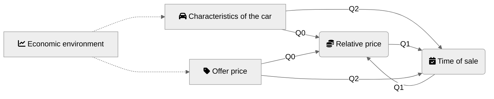

results - automobile-survival
================

## Causality map



## Setup

``` r
library(tidyverse)
```

## Data

``` r
load("data/cars_data.RData")

download_days <- prices_df %>% 
  pull(date) %>% 
  unique() %>% 
  sort()

Sys.setlocale("LC_TIME", "C") # mac os specific language setup
```

    ## [1] "C"

``` r
## [1] "C"
 calendR::calendR(
  start_date = "2021-05-01",
  end_date =  "2022-02-28",
  special.col = "lightblue",
  special.days = download_days - as.Date("2021-04-30"),
  start = "M"
)
```

<!-- -->
